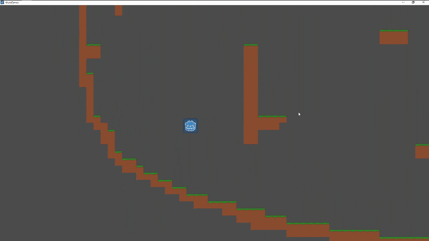

# Hook Demo

## Inspiration

[Teeworlds](https://teeworlds.com/) is an open-source 2D action shooter with a distinct mechanic: A grappling hook.

I wanted to recreate this cool mechanic.

## Tutorial

There's a video version of the tutorial [here](https://youtu.be/Wzrw6_KDMl4).

In short, here are the steps to follow:

1. Set up basic platformer.
2. Make sure to import the `link.png` as repeatable such that it becomes tiled when the Sprite's region is expanded.
3. Move the tip of the chain independently of its origin (which is attached to the player).
4. Rotate, position and resize the chain and tip relative to the origin and the tip coordinates.
5. For the physics cheat a bit:
    1. Apply more pull on the player if they are being dragged upwards.
    2. Pull stronger if the player is also trying to walk in that direction (or less in the opposite direction)

## Credits

For the chain physics I had to look up the original code [here](https://github.com/teeworlds/teeworlds/tree/cd96bda72a9228849ac14199e3daaff906341223/src/game/gamecore.cpp#L262).

## License

The code is [licensed](LICENSE) under [The Unlicense](https://unlicense.org/).
Basically, you can do whatever you want with the code.
